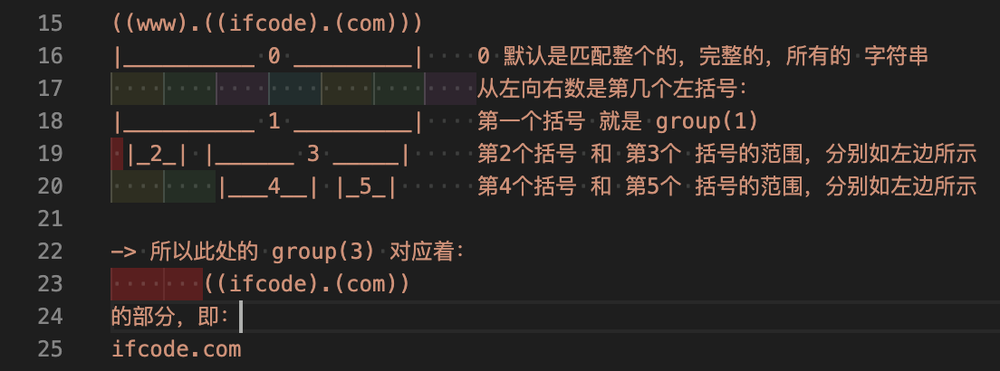

# 如何计算re中的group

## 问题

[正则表达式问题-CSDN论坛](https://bbs.csdn.net/topics/398537401)


## 答案

* reGroupNumberDemo.py

```py
# Function: 解释如何计算Python中正则re的group的编号
# Author: Crifan Li
# Update: 20201215


"""
Q:

正则表达式问题-CSDN论坛
https://bbs.csdn.net/topics/398537401

简答：选 A = ifcode.com

详解：

((www).((ifcode).(com)))
|__________ 0 _________|    0 默认是匹配整个的，完整的，所有的 字符串
                            从左向右数是第几个左括号：
|__________ 1 _________|    第一个括号 就是 group(1)
 |_2_| |______ 3 _____|     第2个括号 和 第3个 括号的范围，分别如左边所示
        |___4__| |_5_|      第4个括号 和 第5个 括号的范围，分别如左边所示

-> 所以此处的 group(3) 对应着：
       ((ifcode).(com))
的部分，即：
ifcode.com

点评：
出题者这么出，是想考你：
（1）是否知道 默认的 group(0)，始终表示是 全部匹配的结果，或者说 是否知道 group(0) 的存在
（2）考察你 group的计算规则，其实就是 从左向右右数，最低是1，每一个左括号 ( 就对应着该group的编号

深度评价：

其实，上图这种写法，是不好的写法
应该用name group 去写，逻辑更清楚

完整代码如下：

"""

import re

inputDomainStr = "www.crifan.com"
domainP = "(?P<wholeDomain>(?P<subDomain>www).(?P<hostOrg>(?P<host>crifan).(?P<org>com)))"
foundDomain = re.search(domainP, inputDomainStr)
if foundDomain:
    wholeMatchStr = foundDomain.group(0)
    print("wholeMatchStr=%s" % wholeMatchStr)

    wholeDomain = foundDomain.group("wholeDomain")
    print("wholeDomain=%s" % wholeDomain)
    subDomain = foundDomain.group("subDomain")
    print("subDomain=%s" % subDomain)
    hostOrg = foundDomain.group("hostOrg")
    print("hostOrg=%s" % hostOrg)
    host = foundDomain.group("host")
    print("host=%s" % host)
    org = foundDomain.group("org")
    print("org=%s" % org)

# wholeMatchStr=www.crifan.com
# wholeDomain=www.crifan.com
# subDomain=www
# hostOrg=crifan.com
# host=crifan
# org=com

print("="*80)

"""
进一步的优化：

（1）点
上面的点 . 其实是能匹配到任意字符，而不仅仅是 点 本身，而此处本意是 只匹配点本身，所以应该优化为 \.

（2）匹配更多域名
如果要匹配其他更多域名，比如：

book.crifan.com
www.crifan.org

等情况，则可以用如下代码：

"""

InputDomainList = [
    "www.crifan.com",
    "book.crifan.com",
    "wiki.crifan.com",
    "www.crifan.net",
    "www.crifan.org",
]


for curIdx, eachDomainStr in enumerate(InputDomainList):
    print("%s %s %s" % ("-"*20, curIdx, "-"*20))
    print("eachDomainStr=%s" % eachDomainStr)
    multiDomainP = "(?P<wholeDomain>(?P<subDomain>\w+)\.(?P<hostOrg>(?P<host>\w+)\.(?P<org>\w+)))"
    foundMultiDomain = re.search(multiDomainP, eachDomainStr)
    if foundMultiDomain:
        curWholeMatchStr = foundMultiDomain.group(0)
        print("curWholeMatchStr=%s" % curWholeMatchStr)

        curWholeDomain = foundMultiDomain.group("wholeDomain")
        print("curWholeDomain=%s" % curWholeDomain)
        curSubDomain = foundMultiDomain.group("subDomain")
        print("curSubDomain=%s" % curSubDomain)
        curHostOrg = foundMultiDomain.group("hostOrg")
        print("curHostOrg=%s" % curHostOrg)
        curHost = foundMultiDomain.group("host")
        print("curHost=%s" % curHost)
        curOrg = foundMultiDomain.group("org")
        print("curOrg=%s" % curOrg)

# -------------------- 0 --------------------
# eachDomainStr=www.crifan.com
# curWholeMatchStr=www.crifan.com
# curWholeDomain=www.crifan.com
# curSubDomain=www
# curHostOrg=crifan.com
# curHost=crifan
# curOrg=com
# -------------------- 1 --------------------
# eachDomainStr=book.crifan.com
# curWholeMatchStr=book.crifan.com
# curWholeDomain=book.crifan.com
# curSubDomain=book
# curHostOrg=crifan.com
# curHost=crifan
# curOrg=com
# -------------------- 2 --------------------
# eachDomainStr=wiki.crifan.com
# curWholeMatchStr=wiki.crifan.com
# curWholeDomain=wiki.crifan.com
# curSubDomain=wiki
# curHostOrg=crifan.com
# curHost=crifan
# curOrg=com
# -------------------- 3 --------------------
# eachDomainStr=www.crifan.net
# curWholeMatchStr=www.crifan.net
# curWholeDomain=www.crifan.net
# curSubDomain=www
# curHostOrg=crifan.net
# curHost=crifan
# curOrg=net
# -------------------- 4 --------------------
# eachDomainStr=www.crifan.org
# curWholeMatchStr=www.crifan.org
# curWholeDomain=www.crifan.org
# curSubDomain=www
# curHostOrg=crifan.org
# curHost=crifan
# curOrg=org
```



另外，可以借助工具查看具体细节，详见：

[regexr.com](../../../tools/regexr_com.md)

