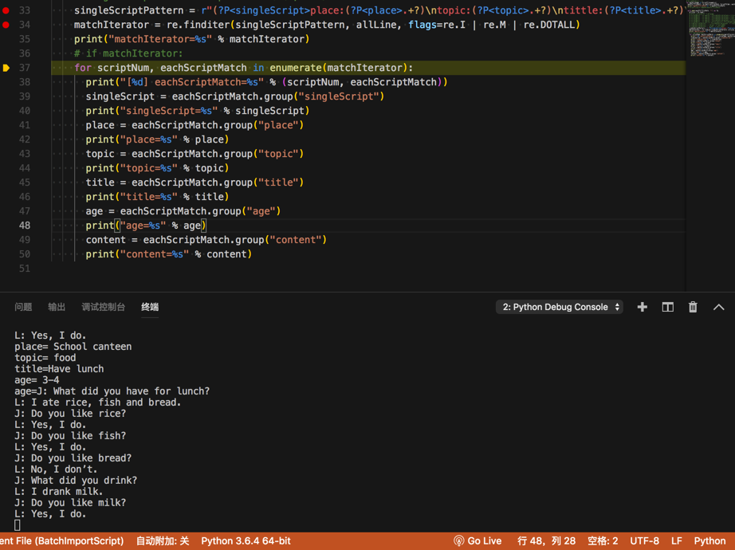

# re.finditer实例

## 从模式对话中提取出每段对话的信息

输入字符串：

```
Place: School canteen
Topic: food
Tittle:Have lunch
Age: 3-4
J: What did you have for lunch?
L: I ate rice, fish and bread.
J: Do you like rice?
L: Yes, I do.
J: Do you like fish?
L: Yes, I do.
J: Do you like bread?
L: No, I don’t.
J: What did you drink?
L: I drank milk.
J: Do you like milk?
L: Yes, I do.

Place: home
Topic: house
Tittle: Doing housework 
Age: 4-5
J: Do you like cooking, mom?
M: Yes, I do a lot. What about you?
J: Mom, you know me. I can’t cook.
M: But can you help me wash dishes?
J: Yes, I can help you.
M: Let’s make a deal, ok?
J: What kind of deal?
M: I’m going to cook.
J: And then?
M: Then you wash the dishes after the meal.
J: That’s ok. I’ d like to help you mom.
M: You are a good boy.

。。。
```

代码：

```python
    singleScriptPattern = r"(?P<singleScript>place:(?P<place>.+?)\ntopic:(?P<topic>.+?)\ntittle:(?P<title>.+?)\nage:(?P<age>.+?)\n(?P<content>.+?))\n{2,1000}"
    matchIterator = re.finditer(singleScriptPattern, allLine, flags=re.I | re.M | re.DOTALL)
    print("matchIterator=%s" % matchIterator)
    # if matchIterator:
    for scriptNum, eachScriptMatch in enumerate(matchIterator):
      print("[%d] eachScriptMatch=%s" % (scriptNum, eachScriptMatch))
      singleScript = eachScriptMatch.group("singleScript")
      print("singleScript=%s" % singleScript)
      place = eachScriptMatch.group("place")
      print("place=%s" % place)
      topic = eachScriptMatch.group("topic")
      print("topic=%s" % topic)
      title = eachScriptMatch.group("title")
      print("title=%s" % title)
      age = eachScriptMatch.group("age")
      print("age=%s" % age)
      content = eachScriptMatch.group("content")
      print("content=%s" % content)
```

log输出：

```bash
>matchIterator=<callable_iterator object at 0x10e3f7b70>
[0] eachScriptMatch=<_sre.SRE_Match object; span=(1, 309), match='Place: School canteen\nTopic: food\nTittle:Have l>
singleScript=Place: School canteen
Topic: food
Tittle:Have lunch
Age: 3-4
J: What did you have for lunch?
L: I ate rice, fish and bread.
J: Do you like rice?
L: Yes, I do.
J: Do you like fish?
L: Yes, I do.
J: Do you like bread?
L: No, I don’t.
J: What did you drink?
L: I drank milk.
J: Do you like milk?
L: Yes, I do.
place= School canteen
topic= food
title=Have lunch
age= 3-4
age=J: What did you have for lunch?
L: I ate rice, fish and bread.
J: Do you like rice?
L: Yes, I do.
J: Do you like fish?
L: Yes, I do.
J: Do you like bread?
L: No, I don’t.
J: What did you drink?
L: I drank milk.
J: Do you like milk?
L: Yes, I do.
```



## 匹配特定模式的成语

背景[需求](https://bbs.csdn.net/topics/396860414?page=1#post-411796043)：

> 问题描述:使用Python正则表达式，进行汉语成语的模式搜索
> 
> 搜索目的地：汉语成语词典
> 
> 搜索目标：几种特殊模式的成语，例如：
> 
> （1）xxyy模式的，高高兴兴，快快乐乐
> 
> （2）数字模式的，三心二意，一泻千里
> 
> （3）动物模式的，鸡鸣狗盗，狐假虎威
>
> （4）……
> 
> 先将汉语成语文件准备好，再在文件中，使用正则表达式，进行搜索。搜索结果，显示在屏幕上，同时保存到一个结果文件中。

代码：

```python
# Function:
#   请教怎样使用Python正则表达式，进行汉语成语模式搜索-CSDN论坛
#   https://bbs.csdn.net/topics/396860414
# Author: Crifan
# Update: 20200619

import re

seperator = "-"

idiomStr = """高高兴兴
快快乐乐
快乐至上
欢欢喜喜
欢天喜地

一心一意
三心二意
一泻千里
三番五次
一鼓作气
以一敌万

鸡鸣狗盗
狐假虎威
兔死狐悲
狗急跳墙
"""

def printSeperatorLine(curTitle):
    print("%s %s %s" % (seperator*30, curTitle , seperator*30))

def printEachMatchGroup(someIter):
    for curIdx, eachMatch in enumerate(someIter):
        curNum = curIdx + 1
        # print("eachMatch=%s" % eachMatch)
        eachMatchWholeStr = eachMatch.group(0)
        print("[%d] %s" % (curNum, eachMatchWholeStr))

printSeperatorLine("xxyy模式成语")

# xxyyP = "(\S)\1(\S)\2"
# xxyyP = "(\S)\1(\S)\2"
# xxyyP = "(\S)\1"
# xxyyP = "(.)\1"
# xxyyP = "(.)\\1"
# xxyyP = "(?:P\S)\\1(\S)\\2"
xxyyP = "(\S)\\1(\S)\\2"
# foundAllXxyy = re.findall(xxyyP, idiomStr, re.S)
# foundAllXxyy = re.search(xxyyP, idiomStr, re.S)
# foundAllXxyyIter = re.finditer(xxyyP, idiomStr, re.S)
foundAllXxyyIter = re.finditer(xxyyP, idiomStr)
# print("foundAllXxyy=%s" % foundAllXxyy)
# for curIdx, eachMatch in enumerate(foundAllXxyyIter):
#     curNum = curIdx + 1
#     # print("eachMatch=%s" % eachMatch)
#     eachMatchWholeStr = eachMatch.group(0)
#     print("[%d] %s" % (curNum, eachMatchWholeStr)
printEachMatchGroup(foundAllXxyyIter)

# print("%s %s %s" % (seperator*30, "数字模式成语" , seperator*30))
printSeperatorLine("数字模式成语")

# refer: 
#   个,十,百,千,万……兆 后面是什么?-作业-慧海网
#   https://www.ajpsp.com/zuoye/4174539
zhcnDigitList = [
    "一",
    "二",
    "三",
    "四",
    "五",
    "六",
    "七",
    "八",
    "九",
    "十",
    "百",
    "千",
    "万",
    "亿",
    "兆",
    "京",
    "垓",
    "秭",
    "穰",
    "沟",
    "涧",
    "正",
    "载",
]
zhcnDigitListGroup = "|".join(zhcnDigitList)
zhcnDigitP = "(%s)\S(%s)\S" % (zhcnDigitListGroup, zhcnDigitListGroup)
zhcnDigitIter = re.finditer(zhcnDigitP, idiomStr, re.S)
printEachMatchGroup(zhcnDigitIter)

printSeperatorLine("动物模式成语")

animalList = [
    "鸡",
    "鸭",
    "猫",
    "狗",
    "猪",
    "兔",
    "狐",
    "狼",
    "虎",
    "豹",
    "狮",
    # TODO：添加更多常见动物
]
animalGroup = "|".join(animalList)
animalP = "(%s)\S(%s)\S" % (animalGroup, animalGroup)
animalIter = re.finditer(animalP, idiomStr, re.S)
printEachMatchGroup(animalIter)
```

输出：

```bash
------------------------------ xxyy模式成语 ------------------------------
[1] 高高兴兴
[2] 快快乐乐
[3] 欢欢喜喜
------------------------------ 数字模式成语 ------------------------------
[1] 一心一意
[2] 三心二意
[3] 一泻千里
[4] 三番五次
------------------------------ 动物模式成语 ------------------------------
[1] 鸡鸣狗盗
[2] 狐假虎威
[3] 兔死狐悲
```