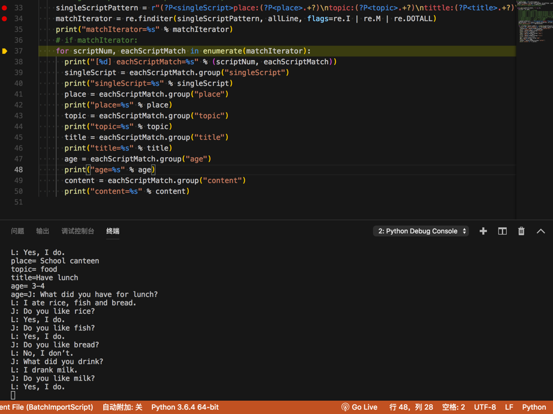

# 从模式对话中提取出每段对话的信息

输入字符串：

```
Place: School canteen
Topic: food
Tittle:Have lunch
Age: 3-4
J: What did you have for lunch?
L: I ate rice, fish and bread.
J: Do you like rice?
L: Yes, I do.
J: Do you like fish?
L: Yes, I do.
J: Do you like bread?
L: No, I don’t.
J: What did you drink?
L: I drank milk.
J: Do you like milk?
L: Yes, I do.

Place: home
Topic: house
Tittle: Doing housework 
Age: 4-5
J: Do you like cooking, mom?
M: Yes, I do a lot. What about you?
J: Mom, you know me. I can’t cook.
M: But can you help me wash dishes?
J: Yes, I can help you.
M: Let’s make a deal, ok?
J: What kind of deal?
M: I’m going to cook.
J: And then?
M: Then you wash the dishes after the meal.
J: That’s ok. I’ d like to help you mom.
M: You are a good boy.

。。。
```

代码：

```python
    singleScriptPattern = r"(?P<singleScript>place:(?P<place>.+?)\ntopic:(?P<topic>.+?)\ntittle:(?P<title>.+?)\nage:(?P<age>.+?)\n(?P<content>.+?))\n{2,1000}"
    matchIterator = re.finditer(singleScriptPattern, allLine, flags=re.I | re.M | re.DOTALL)
    print("matchIterator=%s" % matchIterator)
    # if matchIterator:
    for scriptNum, eachScriptMatch in enumerate(matchIterator):
      print("[%d] eachScriptMatch=%s" % (scriptNum, eachScriptMatch))
      singleScript = eachScriptMatch.group("singleScript")
      print("singleScript=%s" % singleScript)
      place = eachScriptMatch.group("place")
      print("place=%s" % place)
      topic = eachScriptMatch.group("topic")
      print("topic=%s" % topic)
      title = eachScriptMatch.group("title")
      print("title=%s" % title)
      age = eachScriptMatch.group("age")
      print("age=%s" % age)
      content = eachScriptMatch.group("content")
      print("content=%s" % content)
```

log输出：

```bash
>matchIterator=<callable_iterator object at 0x10e3f7b70>
[0] eachScriptMatch=<_sre.SRE_Match object; span=(1, 309), match='Place: School canteen\nTopic: food\nTittle:Have l>
singleScript=Place: School canteen
Topic: food
Tittle:Have lunch
Age: 3-4
J: What did you have for lunch?
L: I ate rice, fish and bread.
J: Do you like rice?
L: Yes, I do.
J: Do you like fish?
L: Yes, I do.
J: Do you like bread?
L: No, I don’t.
J: What did you drink?
L: I drank milk.
J: Do you like milk?
L: Yes, I do.
place= School canteen
topic= food
title=Have lunch
age= 3-4
age=J: What did you have for lunch?
L: I ate rice, fish and bread.
J: Do you like rice?
L: Yes, I do.
J: Do you like fish?
L: Yes, I do.
J: Do you like bread?
L: No, I don’t.
J: What did you drink?
L: I drank milk.
J: Do you like milk?
L: Yes, I do.
```


