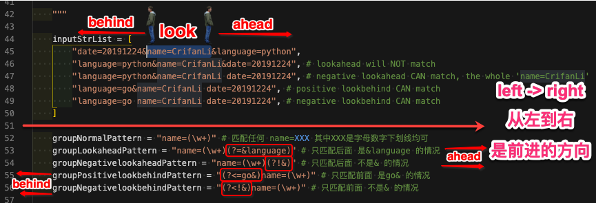

# 环视断言

* `环视断言` = `look around (assertion)`
  * 包括
    * `look ahead (assertion)`=`正向断言`
      * `positive lookahead assertion` ：`(?=xxx)`
      * `negative lookahead assertion` ：`(?!xxx)`
    * `look behind (assertion)`=`反向断言`
      * `positive lookbehind assertion`：`(?<=xxx)`
      * `negative lookbehind assertion`：`(?<!xxx)`

如果觉得look ahead和look behind很费解的话，看这个图，就容易懂了：



总体就2个逻辑：

* 站在 当前所要匹配的内容
  * 往哪看
    * ahead：向前 向右 ➡️ 当前字符串继续往后的方向
      * **从左到右** 叫做 向前，属于正向
    * behind：向左 ◀️ 向后 ⬅️ 当前字符串之前的方向
      * 所以会额外加上一个 `<`**小于号** 表示向后看的意思
        * `(?<=xxx)`
        * `(?<!xxx)`
  * positive/negative：
    * positive=正面的，肯定的，用 **等于号**`=`，意思是：`=xxx`
    * negative=负面的，否定的，用 **不等于号**`!`，意思是：`!=xxx`

==》因此推导出：

* `positive lookahead assertion`：`(?=xxx)`
* `negative lookahead assertion`：`(?!xxx)`
* `positive lookbehind assertion`： `(?<=xxx)`
* `negative lookbehind assertion`：`(?<!xxx)`

[官网](https://docs.python.org/3/library/re.html#regular-expression-syntax)文档：

```bash
(...)
    Matches whatever regular expression is inside the parentheses, and indicates the start and end of a group;
    the contents of a group can be retrieved after a match has been performed,
    and can be matched later in the string with the \number special sequence, described below.
    To match the literals '(' or ')', use \( or \), or enclose them inside a character class: [(], [)].


(?=...)
    Matches if ... matches next, but doesn’t consume any of the string.
    This is called a lookahead assertion.
    For example, Isaac (?=Asimov) will match 'Isaac ' only if it’s followed by 'Asimov'.


(?!...)
    Matches if ... doesn’t match next.
    This is a negative lookahead assertion.
    For example, Isaac (?!Asimov) will match 'Isaac ' only if it’s not followed by 'Asimov'.


(?<=...)
    Matches if the current position in the string is preceded by a match for ... that ends at the current position.
    This is called a positive lookbehind assertion.
    (?<=abc)def will find a match in 'abcdef', since the lookbehind will back up 3 characters and check if the contained pattern matches.
    The contained pattern must only match strings of some fixed length, meaning that abc or a|b are allowed, but a* and a{3,4} are not.
    Note that patterns which start with positive lookbehind assertions will not match at the beginning of the string being searched;


(?<!...)
    Matches if the current position in the string is not preceded by a match for ....
    This is called a negative lookbehind assertion.
    Similar to positive lookbehind assertions, the contained pattern must only match strings of some fixed length.
    Patterns which start with negative lookbehind assertions may match at the beginning of the string being searched.
```

代码详细解释：

```python
#!/usr/bin/python
# -*- coding: utf-8 -*-
# Author: Crifan Li
# Update: 20191224
# Function: Demo python re lookahead and lookbehind group

import re

def demoReLookAheadBehind():
    inputStrList = [
        "date=20191224&name=CrifanLi&language=python",
        "language=python&name=CrifanLi&date=20191224", # lookahead will NOT match
        "language=python&name=CrifanLi date=20191224", # negative lookahead CAN match, the whole 'name=CrifanLi'
        "language=go&name=CrifanLi date=20191224", # positive lookbehind CAN match
        "language=go name=CrifanLi date=20191224", # negative lookbehind CAN match
    ]

    groupNormalPattern = "name=(\w+)" # 匹配任何 name=XXX 其中XXX是字母数字下划线均可
    groupLookaheadPattern = "name=(\w+)(?=&language)" # 只匹配后面 是&language 的情况
    groupNegativelookaheadPattern = "name=(\w+)(?!&)" # 只匹配后面 不是& 的情况
    groupPositivelookbehindPattern = "(?<=go&)name=(\w+)" # 只匹配前面 是go& 的情况
    groupNegativelookbehindPattern = "(?<!&)name=(\w+)" # 只匹配前面 不是& 的情况

    for curIdx, eachInputStr in enumerate(inputStrList):
        print("\n%s [%d] %s %s" % ("="*20, curIdx, eachInputStr, "="*20))

        print("%s %s %s" % ("-"*10, "normal group", "-"*10))
        foundGroupNormal = re.search(groupNormalPattern, eachInputStr)
        print("foundGroupNormal=%s" % foundGroupNormal)
        if foundGroupNormal:
            wholeMatchStrNormal = foundGroupNormal.group(0)
            print("wholeMatchStrNormal=%s" % wholeMatchStrNormal)
            matchedGroupsNormal = foundGroupNormal.groups()
            print("matchedGroupsNormal=%s" % (matchedGroupsNormal, ))
            foundName = foundGroupNormal.group(1)
            print("foundName=%s" % foundName)

        print("%s %s %s" % ("-"*10, "lookahead group", "-"*10))
        foundGroupLookahead = re.search(groupLookaheadPattern, eachInputStr)
        print("foundGroupLookahead=%s" % foundGroupLookahead)
        if foundGroupLookahead:
            wholeMatchStrLookahead = foundGroupLookahead.group(0)
            print("wholeMatchStrLookahead=%s" % wholeMatchStrLookahead)
            matchedGroupsLookahead = foundGroupLookahead.groups()
            print("matchedGroupsLookahead=%s" % (matchedGroupsLookahead, ))
            foundName = foundGroupLookahead.group(1)
            print("foundName=%s" % foundName)

        print("%s %s %s" % ("-"*10, "negative lookahead group", "-"*10))
        foundGroupNegativelookahead = re.search(groupNegativelookaheadPattern, eachInputStr)
        print("foundGroupNegativelookahead=%s" % foundGroupNegativelookahead)
        if foundGroupNegativelookahead:
            wholeMatchStrNegativelookahead = foundGroupNegativelookahead.group(0)
            print("wholeMatchStrNegativelookahead=%s" % wholeMatchStrNegativelookahead)
            matchedGroupsNegativelookahead = foundGroupNegativelookahead.groups()
            print("matchedGroupsNegativelookahead=%s" % (matchedGroupsNegativelookahead, ))
            foundName = foundGroupNegativelookahead.group(1)
            print("foundName=%s" % foundName)

        print("%s %s %s" % ("-"*10, "positive lookahead group", "-"*10))
        foundGroupPositivelookbehind = re.search(groupPositivelookbehindPattern, eachInputStr)
        print("foundGroupPositivelookbehind=%s" % foundGroupPositivelookbehind)
        if foundGroupPositivelookbehind:
            wholeMatchStrPositivelookbehind = foundGroupPositivelookbehind.group(0)
            print("wholeMatchStrPositivelookbehind=%s" % wholeMatchStrPositivelookbehind)
            matchedGroupsPositivelookbehind = foundGroupPositivelookbehind.groups()
            print("matchedGroupsPositivelookbehind=%s" % (matchedGroupsPositivelookbehind, ))
            foundName = foundGroupPositivelookbehind.group(1)
            print("foundName=%s" % foundName)

        print("%s %s %s" % ("-"*10, "positive lookahead group", "-"*10))
        foundGroupNegativelookbehind = re.search(groupNegativelookbehindPattern, eachInputStr)
        print("foundGroupNegativelookbehind=%s" % foundGroupNegativelookbehind)
        if foundGroupNegativelookbehind:
            wholeMatchStrNegativelookbehind = foundGroupNegativelookbehind.group(0)
            print("wholeMatchStrNegativelookbehind=%s" % wholeMatchStrNegativelookbehind)
            matchedGroupsNegativelookbehind = foundGroupNegativelookbehind.groups()
            print("matchedGroupsNegativelookbehind=%s" % (matchedGroupsNegativelookbehind, ))
            foundName = foundGroupNegativelookbehind.group(1)
            print("foundName=%s" % foundName)

    # ==================== [0] date=20191224&name=CrifanLi&language=python ====================
    # ---------- normal group ----------
    # foundGroupNormal=<re.Match object; span=(14, 27), match='name=CrifanLi'>
    # wholeMatchStrNormal=name=CrifanLi
    # matchedGroupsNormal=('CrifanLi',)
    # foundName=CrifanLi
    # ---------- lookahead group ----------
    # foundGroupLookahead=<re.Match object; span=(14, 27), match='name=CrifanLi'>
    # wholeMatchStrLookahead=name=CrifanLi
    # matchedGroupsLookahead=('CrifanLi',)
    # foundName=CrifanLi
    # ---------- negative lookahead group ----------
    # foundGroupNegativelookahead=<re.Match object; span=(14, 26), match='name=CrifanL'>
    # wholeMatchStrNegativelookahead=name=CrifanL
    # matchedGroupsNegativelookahead=('CrifanL',)
    # foundName=CrifanL
    # ---------- positive lookahead group ----------
    # foundGroupPositivelookbehind=None
    # ---------- positive lookahead group ----------
    # foundGroupNegativelookbehind=None

    # ==================== [1] language=python&name=CrifanLi&date=20191224 ====================
    # ---------- normal group ----------
    # foundGroupNormal=<re.Match object; span=(16, 29), match='name=CrifanLi'>
    # wholeMatchStrNormal=name=CrifanLi
    # matchedGroupsNormal=('CrifanLi',)
    # foundName=CrifanLi
    # ---------- lookahead group ----------
    # foundGroupLookahead=None
    # ---------- negative lookahead group ----------
    # foundGroupNegativelookahead=<re.Match object; span=(16, 28), match='name=CrifanL'>
    # wholeMatchStrNegativelookahead=name=CrifanL
    # matchedGroupsNegativelookahead=('CrifanL',)
    # foundName=CrifanL
    # ---------- positive lookahead group ----------
    # foundGroupPositivelookbehind=None
    # ---------- positive lookahead group ----------
    # foundGroupNegativelookbehind=None

    # ==================== [2] language=python&name=CrifanLi date=20191224 ====================
    # ---------- normal group ----------
    # foundGroupNormal=<re.Match object; span=(16, 29), match='name=CrifanLi'>
    # wholeMatchStrNormal=name=CrifanLi
    # matchedGroupsNormal=('CrifanLi',)
    # foundName=CrifanLi
    # ---------- lookahead group ----------
    # foundGroupLookahead=None
    # ---------- negative lookahead group ----------
    # foundGroupNegativelookahead=<re.Match object; span=(16, 29), match='name=CrifanLi'>
    # wholeMatchStrNegativelookahead=name=CrifanLi
    # matchedGroupsNegativelookahead=('CrifanLi',)
    # foundName=CrifanLi
    # ---------- positive lookahead group ----------
    # foundGroupPositivelookbehind=None
    # ---------- positive lookahead group ----------
    # foundGroupNegativelookbehind=None

    # ==================== [3] language=go&name=CrifanLi date=20191224 ====================
    # ---------- normal group ----------
    # foundGroupNormal=<re.Match object; span=(12, 25), match='name=CrifanLi'>
    # wholeMatchStrNormal=name=CrifanLi
    # matchedGroupsNormal=('CrifanLi',)
    # foundName=CrifanLi
    # ---------- lookahead group ----------
    # foundGroupLookahead=None
    # ---------- negative lookahead group ----------
    # foundGroupNegativelookahead=<re.Match object; span=(12, 25), match='name=CrifanLi'>
    # wholeMatchStrNegativelookahead=name=CrifanLi
    # matchedGroupsNegativelookahead=('CrifanLi',)
    # foundName=CrifanLi
    # ---------- positive lookahead group ----------
    # foundGroupPositivelookbehind=<re.Match object; span=(12, 25), match='name=CrifanLi'>
    # wholeMatchStrPositivelookbehind=name=CrifanLi
    # matchedGroupsPositivelookbehind=('CrifanLi',)
    # foundName=CrifanLi
    # ---------- positive lookahead group ----------
    # foundGroupNegativelookbehind=None

    # ==================== [4] language=go name=CrifanLi date=20191224 ====================
    # ---------- normal group ----------
    # foundGroupNormal=<re.Match object; span=(12, 25), match='name=CrifanLi'>
    # wholeMatchStrNormal=name=CrifanLi
    # matchedGroupsNormal=('CrifanLi',)
    # foundName=CrifanLi
    # ---------- lookahead group ----------
    # foundGroupLookahead=None
    # ---------- negative lookahead group ----------
    # foundGroupNegativelookahead=<re.Match object; span=(12, 25), match='name=CrifanLi'>
    # wholeMatchStrNegativelookahead=name=CrifanLi
    # matchedGroupsNegativelookahead=('CrifanLi',)
    # foundName=CrifanLi
    # ---------- positive lookahead group ----------
    # foundGroupPositivelookbehind=None
    # ---------- positive lookahead group ----------
    # foundGroupNegativelookbehind=<re.Match object; span=(12, 25), match='name=CrifanLi'>
    # wholeMatchStrNegativelookbehind=name=CrifanLi
    # matchedGroupsNegativelookbehind=('CrifanLi',)
    # foundName=CrifanLi

if __name__ == "__main__":
    demoReLookAheadBehind()
```

对于代码中的结果，总结起来就是：

* name=(\w+)：普通的group
  * 匹配结果
    * 5个都匹配
      * date=20191224&name=CrifanLi&language=python
      * language=python&name=CrifanLi&date=20191224
      * language=python&name=CrifanLi date=20191224
      * language=go&name=CrifanLi date=20191224
      * language=go name=CrifanLi date=20191224
    * 匹配到内容都是：
      * name=CrifanLi
  * 解析：因为只是普通的(xxx)的组，没有限制，所以都能匹配到
* name=(\w+)(?=&language)：lookahead=positive lookahead=正向先行断言
  * 匹配结果
    * 只匹配了1个：
      * date=20191224&name=CrifanLi&language=python
    * 其余4个都不匹配
      * language=python&name=CrifanLi&date=20191224
      * language=python&name=CrifanLi date=20191224
      * language=go&name=CrifanLi date=20191224
      * language=go name=CrifanLi date=20191224
  * 解析：
    * (?=&language) 表示 后面一定是 &language
      * 而上面4个的后面，分别是：
        * &date=
        * date=
        * date=
        * date=
      * 所以都不匹配
* name=(\w+)(?!&)：negative look ahead=负向先行断言
  * 匹配结果
    * 5个都匹配到了，但是匹配的内容不一样
      * 2个匹配到了：name=CrifanL
        * date=20191224&name=CrifanLi&language=python
        * language=python&name=CrifanLi&date=20191224
      * 3个匹配到了：name=CrifanLi
        * language=python&name=CrifanLi date=20191224
        * language=go&name=CrifanLi date=20191224
        * language=go name=CrifanLi date=20191224
  * 解析
    * 注意 前2个匹配到的 最后没有i，是CrifanL，而不是CrifanLi
    * 因为(?!&)表示 后面不能是 &
      * 所以类似于
        * name=CrifanLi&language
        * name=CrifanLi&date
      * 这种，只能匹配到L，而不是i，因为i后面是&，此处要求后面不能是&
* (?<=go&)name=(\w+)：positive look behind=正向后行断言
  * 匹配结果
    * 只匹配到1个
      * language=go&name=CrifanLi date=20191224
  * 解析
    * 因为此处(?<=go&)意思是，前面一定要是 go& 所以只有这个匹配
    * 其他的
      * 20191224&name=
      * python&name=
      * python&name=
      * go name=
    * 中name=的前面 都不符合条件
* (?<!&)name=(\w+)：negative look behind=负向后行断言
  * 匹配结果
    * 只匹配到1个：
      * language=go name=CrifanLi date=20191224
  * 解析
    * 因为(?<!&)的意思是：前面不能是 &
      * 所以只有
        * go name=
      * 这个符合，而其余的
        * 20191224&name=
        * python&name=
        * python&name=
        * go&name=
      * name=前面都是&，所以不符合条件，不匹配

## （positive) look behind

官网解释：

```bash
(?<=...)
    Matches if the current position in the string is preceded by a match for ... that ends at the current position.
    This is called a positive lookbehind assertion.
    (?<=abc)def will find a match in 'abcdef', since the lookbehind will back up 3 characters and check if the contained pattern matches.
    The contained pattern must only match strings of some fixed length, meaning that abc or a|b are allowed, but a* and a{3,4} are not.
    Note that patterns which start with positive lookbehind assertions will not match at the beginning of the string being searched;

(?P<name>...)
    Similar to regular parentheses, but the substring matched by the group is accessible via the symbolic group name name.
    Group names must be valid Python identifiers, and each group name must be defined only once within a regular expression.
    A symbolic group is also a numbered group, just as if the group were not named.
```

用代码详细解释：

```python
#!/usr/bin/python
# -*- coding: utf-8 -*-
# Author: Crifan Li
# Update: 20191224
# Function: Demo python re lookbehind group

import re

def demoReLookbehind():
    namedGroupPattern = "(SID=)(?P<sidValue>[^&]+)"
    lookBehindGroupPattern = "(?<=SID=)(?P<sidValue>[^&]+)"
    """
    正则含义的解释：
        (?<=SID=)[^&]+
            (?<=SID=) 属于(?<=XXX)，其中XXX是"SID="这个固定长度的4个字符的字符串 用于匹配你要的值的前面的部分 SID=YYY中的 SID=
            [^&]+
                [] 中括号中是所允许出现的字符
                ^ 是取反，除了...之外的，所以^&就是除了&字符之外的，因为你要匹配的字符串是
                    SID=8E3qOreRiOnbhkl84Uc&YYY 可以避免匹配到 最后的&和YYY
                + 表示1个或更多个 直到遇到 不允许出现的&字符，匹配此处的 即从8到c，即8E3qOreRiOnbhkl84Uc
    """

    inputStrList = [
        "GeneralSearch&SID=8E3qOreRiOnbhkl84Uc&preferencesSaved",
    ]
    for eachInputStr in inputStrList:
        print("="*60)
        foundNamedGroup = re.search(namedGroupPattern, eachInputStr)
        foundLookbehindGroup = re.search(lookBehindGroupPattern, eachInputStr)
        if foundNamedGroup and foundLookbehindGroup:
            print("foundNamedGroup=%s" % foundNamedGroup)
            print("foundLookbehindGroup=%s" % foundLookbehindGroup)

            groupsNamedGroup = foundNamedGroup.groups()
            print("groupsNamedGroup=%s" % (groupsNamedGroup, ))
            groupsLookbehindGroup = foundLookbehindGroup.groups()
            print("groupsLookbehindGroup=%s" % (groupsLookbehindGroup, ))

            wholeStrNamedGroup = foundNamedGroup.group(0)
            print("wholeStrNamedGroup=%s" % wholeStrNamedGroup)
            wholeStrLookbehindGroup = foundLookbehindGroup.group(0)
            print("wholeStrLookbehindGroup=%s" % wholeStrLookbehindGroup)

            sidValueNamedGroup = foundNamedGroup.group("sidValue")
            print("sidValueNamedGroup=%s" % sidValueNamedGroup)
            sidValueLookbehindGroup = foundLookbehindGroup.group("sidValue")
            print("sidValueLookbehindGroup=%s" % sidValueLookbehindGroup)

    # foundNamedGroup=<re.Match object; span=(14, 37), match='SID=8E3qOreRiOnbhkl84Uc'>
    # foundLookbehindGroup=<re.Match object; span=(18, 37), match='8E3qOreRiOnbhkl84Uc'>
    # groupsNamedGroup=('SID=', '8E3qOreRiOnbhkl84Uc')
    # groupsLookbehindGroup=('8E3qOreRiOnbhkl84Uc',)
    # wholeStrNamedGroup=SID=8E3qOreRiOnbhkl84Uc
    # wholeStrLookbehindGroup=8E3qOreRiOnbhkl84Uc
    # sidValueNamedGroup=8E3qOreRiOnbhkl84Uc
    # sidValueLookbehindGroup=8E3qOreRiOnbhkl84Uc

if __name__ == "__main__":
    demoReLookbehind()
```
