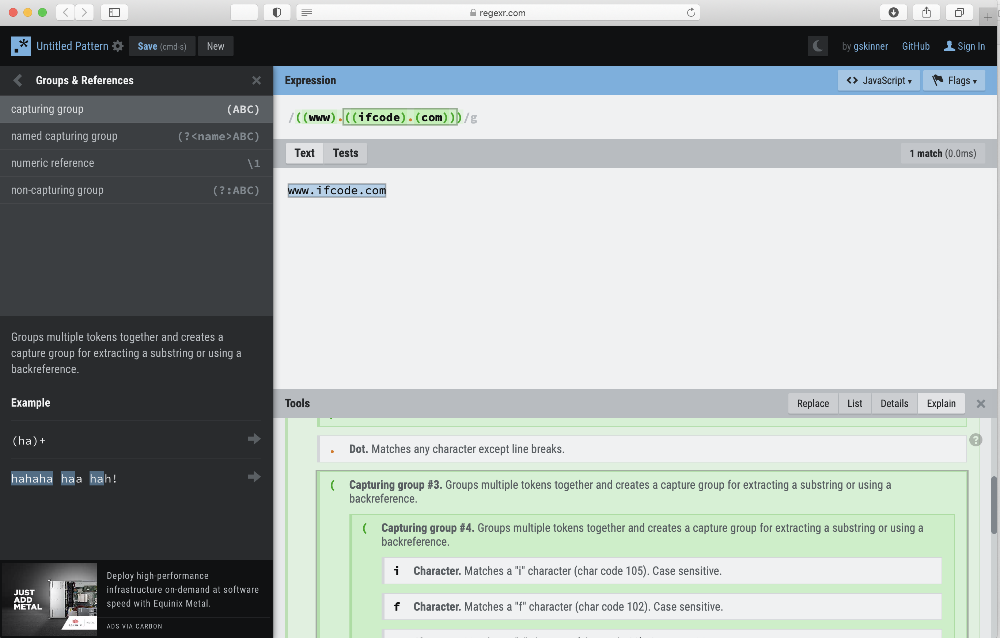

# regexr.com

对于正则语法，如果不太熟悉，可以借助于第三方工具，比如：

* 在线网站
  * [RegExr: Learn, Build, & Test RegEx](https://regexr.com)
    * https://regexr.com

以辅助你查看的更加清楚每个group的具体细节和语法解释。

## 举例

比如前面的：

[如何计算re中的group](../re_search/group/example/calc_re_group.md)

中的：

```bash
((www).((ifcode).(com)))
```

去匹配：

`www.ifcode.com`

的效果是：


